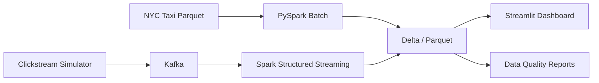

# StreamPipe

PySpark + Kafka + Delta Lake 기반의 **실시간 이벤트 로그 분석 파이프라인**.
NYC Taxi 월 300만 건 데이터와 시뮬레이션 클릭스트림을 사용해 Batch/Streaming 이중 파이프라인을 구축하고,
성능 비교 + 실시간 이상 탐지 + 데이터 품질 검증까지 하나의 Streamlit 대시보드에서 통합 조회합니다.

## 아키텍처



**Sources** (NYC Taxi + Clickstream) → **Kafka** (Event Transport) → **Spark** (Batch + Structured Streaming) → **Delta / Parquet** (Metrics + Quality) → **Dashboard** (Streamlit + Plotly)

## 기술 스택

| 영역 | 기술 |
|------|------|
| 분산 처리 | PySpark 3.5 |
| 메시징 | Apache Kafka 4.0 (KRaft) |
| 저장 계층 | Delta Lake 3.3 / Parquet |
| 시각화 | Streamlit, Plotly |
| 데이터 품질 | 커스텀 DQ 규칙 (9개 Taxi + 2개 Clickstream) |
| 환경 구성 | Docker Compose |

## 주요 결과

### Batch 분석 (NYC Taxi January 2023 - 3,066,766건)

| 분석 항목 | 내용 |
|-----------|------|
| 시간대별 승차 패턴 | 24시간 pickup volume 분포 |
| 지역별 매출 집계 | Zone lookup join 기반 borough/zone revenue |
| 결제별 팁 비율 | payment_type별 tip-to-fare ratio |
| 데이터 품질 | issue_rows 120,637건 / year_mismatch 38건 / unresolved_zone 41,763건 |

### pandas vs PySpark 벤치마크

| 데이터 규모 | pandas | PySpark | 비율 |
|-------------|--------|---------|------|
| 100K rows | 0.59s | 5.90s | 10.1x |
| 500K rows | 0.97s | 3.58s | 3.7x |
| 3M rows (full) | 5.65s | 6.61s | 1.2x |

> 소규모에서는 pandas가 빠르지만 데이터가 커질수록 PySpark의 분산 처리가 격차를 좁힙니다.

### Streaming 분석

| 항목 | 결과 |
|------|------|
| End-to-end latency | 8.92s (publish 0.17s + processing 8.75s) |
| 전환 퍼널 | page_view(10) → cart(6) → purchase(1), page→purchase 10% |
| 이상 탐지 | Z-score 기반, traffic_spike + low_purchase_conversion + cart_abandonment_risk |
| Alert severity | high (Z-score: 8.49) |

### Delta Lake

| 기능 | 상태 |
|------|------|
| Parquet → Delta 마이그레이션 | 3,066,766건 무손실 전환 |
| Time Travel | version 0(3행) → version 3(5행) 버전 조회 |
| Schema Evolution | `channel` 컬럼 자동 병합 (`mergeSchema=true`) |
| OPTIMIZE + ZORDER | Compaction(4→1 files) + ZORDER BY(event_date, channel) |

## 빠른 시작

### 1) 환경 준비

```bash
python -m venv .venv
source .venv/bin/activate
pip install -r requirements.txt
```

### 2) 인프라 실행

```bash
make up            # Kafka + Spark 컨테이너 기동
make topic-create  # clickstream.events 토픽 생성
make ps            # 컨테이너 상태 확인
```

> Kafka 4.x KRaft 모드를 사용하므로 Zookeeper가 필요 없습니다.

### 3) 데이터 준비 + 분석

```bash
# NYC Taxi 데이터 다운로드
make nyc-download

# Batch 분석 (Parquet / Delta)
make batch
make batch-delta

# Delta Lake 데모
make delta-migrate
make delta-demo

# 벤치마크
make benchmark
make benchmark-partitioning
make benchmark-compare

# Streaming 데모
make stream-demo

# 대시보드
streamlit run app.py
```

> `make` 없는 환경에서는 각 명령어를 직접 실행할 수 있습니다. 아래 **CLI 레퍼런스** 참고.

## 폴더 구조

```text
.
├── app.py                      # Streamlit 대시보드
├── docker-compose.yml          # Kafka + Spark 클러스터
├── configs/settings.yaml       # 프로젝트 설정
├── src/
│   ├── batch/
│   │   ├── main.py             # NYC Taxi 배치 파이프라인
│   │   └── delta_examples.py   # Delta migration / time travel 데모
│   ├── streaming/
│   │   ├── main.py             # Kafka → Structured Streaming
│   │   └── demo.py             # 퍼널 + 이상탐지 데모
│   ├── benchmarks/
│   │   ├── pandas_vs_spark.py  # pandas vs PySpark 비교
│   │   ├── batch_vs_streaming.py
│   │   └── partitioning_effect.py
│   ├── quality/checks.py       # DQ 규칙 (9 taxi + 2 clickstream)
│   ├── simulator/clickstream_generator.py
│   ├── dashboard/data_loader.py
│   ├── data/nyc_taxi.py        # NYC TLC 다운로드 자동화
│   └── common/
├── tests/                      # 39개 테스트 함수
├── docs/
│   ├── ARCHITECTURE.md
│   └── reports/                # 자동 생성 리포트 (JSON + MD)
├── data/
│   ├── raw/                    # NYC Taxi 원천 데이터
│   ├── processed/              # Batch / Delta 산출물
│   └── benchmarks/             # 벤치마크 리포트
└── notebooks/
```

## CLI 레퍼런스

<details>
<summary>전체 명령어 펼치기</summary>

```bash
# NYC Taxi 다운로드 + 스키마 리포트
python -m src.data.nyc_taxi prepare \
  --dataset yellow --year 2023 --months 1-3 \
  --output-dir data/raw/nyc_taxi \
  --report-dir docs/reports/nyc_taxi_2023_yellow \
  --download-zone-lookup

# 클릭스트림 시뮬레이터
python -m src.simulator.clickstream_generator --count 5 --sleep 0
python -m src.simulator.clickstream_generator \
  --send-kafka --bootstrap-servers localhost:9092 \
  --topic clickstream.events --count 10 --sleep 0

# Batch 분석
python -m src.batch.main \
  --input-path data/raw/nyc_taxi/yellow/2023 \
  --zone-lookup-path data/raw/nyc_taxi/reference/taxi_zone_lookup.csv \
  --pickup-year 2023 --output-path data/processed/batch_taxi_metrics

# Delta Lake 저장
python -m src.batch.main \
  --input-path data/raw/nyc_taxi/yellow/2023 \
  --zone-lookup-path data/raw/nyc_taxi/reference/taxi_zone_lookup.csv \
  --pickup-year 2023 --output-format delta \
  --output-path data/processed/delta/batch_taxi_metrics

# Delta 예제
python -m src.batch.delta_examples migrate \
  --source-path data/processed/batch_taxi_metrics_jan/summary \
  --target-path data/processed/delta/day4/batch_summary_delta_example \
  --report-path docs/reports/delta_migration_example

python -m src.batch.delta_examples demo \
  --target-path data/processed/delta/day4/time_travel_orders_demo \
  --report-path docs/reports/delta_time_travel_demo

# 벤치마크
python -m src.benchmarks.pandas_vs_spark \
  --input-path data/raw/nyc_taxi/yellow/2023 \
  --zone-lookup-path data/raw/nyc_taxi/reference/taxi_zone_lookup.csv \
  --pickup-year 2023 --row-limits 100000 500000 full \
  --output-path data/benchmarks/pandas_vs_spark_jan2023

python -m src.benchmarks.batch_vs_streaming \
  --benchmark-report data/benchmarks/pandas_vs_spark_jan2023.json \
  --output-path data/benchmarks/batch_vs_streaming_jan2023

python -m src.benchmarks.partitioning_effect \
  --output-root data/benchmarks/partitioning_effect_demo_data \
  --report-path data/benchmarks/partitioning_effect_demo

# Streaming
python -m src.streaming.demo \
  --bootstrap-servers localhost:9092 \
  --topic clickstream.events \
  --kafka-package org.apache.spark:spark-sql-kafka-0-10_2.12:3.5.8

# 대시보드
streamlit run app.py
```

</details>

## Batch vs Streaming: 언제 무엇을 쓸까?

| 기준 | Batch | Streaming |
|------|-------|-----------|
| 데이터 특성 | bounded, 히스토리 분석 | unbounded, 실시간 이벤트 |
| Latency | 초~분 (전체 처리 후 결과) | 초 이내 (이벤트 단위) |
| Throughput | 높음 (전체 데이터 한 번에) | 이벤트 burst 규모에 의존 |
| 적합 사례 | 일별 리포트, 대규모 집계, 벤치마크 | 이상 탐지, 실시간 퍼널, 알림 |
| 이 프로젝트 | NYC Taxi 3M건 배치 분석 | 클릭스트림 퍼널 + Z-score 이상탐지 |

## 한계점 + 다음 스텝

**한계점**
- 단일 노드 Spark 실행으로 진정한 분산 스케일링 효과 미확인
- 파티셔닝 벤치마크가 소규모 synthetic 데이터 기반 (실 데이터 대비 오버헤드가 큼)
- Streamlit Cloud 배포 시 실시간 Kafka 연결 불가 (pre-computed 데이터로 대체)

**다음 스텝**
- 멀티 노드 Spark 클러스터에서 스케일링 벤치마크
- Great Expectations 기반 선언적 DQ 규칙 전환
- Kafka Connect → Delta Lake 직접 연결 (Streaming sink 개선)
- CI/CD 파이프라인 연결 (테스트 자동화 + 리포트 자동 생성)
