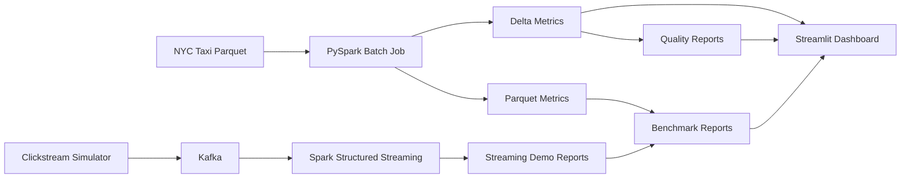

# StreamPipe Architecture

## 목표
하나의 저장소 안에서 다음 4가지를 연결한다.

1. NYC Taxi 대용량 batch 처리
2. Kafka 기반 clickstream streaming 분석
3. Delta Lake 저장 계층과 time travel / schema evolution 예제
4. Streamlit 대시보드에서 batch / streaming / benchmark / quality 결과 통합 조회

## End-To-End Flow

## 컴포넌트 책임
- `src/data/nyc_taxi.py`
  공식 NYC TLC Parquet 다운로드와 schema report 생성
- `src/batch/main.py`
  NYC Taxi batch 집계와 Parquet / Delta 저장
- `src/batch/delta_examples.py`
  Parquet -> Delta migration, Delta time travel, schema evolution 예제
- `src/streaming/main.py`
  Kafka -> Structured Streaming -> event/funnel/anomaly 집계
- `src/streaming/demo.py`
  결정적 이벤트 burst를 발행하고 memory sink 결과와 timing 메타데이터를 남김
- `src/quality/checks.py`
  clickstream + taxi 데이터 품질 규칙과 Spark/Python 양쪽 summary 계산
- `src/benchmarks/`
  pandas vs PySpark, Batch vs Streaming 비교 리포트 생성
- `src/dashboard/data_loader.py`
  대시보드용 report / parquet preview 로딩

## 저장 계층
- Raw
  - `data/raw/nyc_taxi/...`
- Batch Parquet
  - `data/processed/batch_taxi_metrics_jan/...`
- Batch Delta
  - `data/processed/delta/batch_taxi_metrics_jan_delta/...`
- Delta Day 4 examples
  - `data/processed/delta/day4/batch_summary_delta_example`
  - `data/processed/delta/day4/time_travel_orders_demo`
- Reports
  - `docs/reports/*.json`
  - `docs/reports/*.md`

## Batch / Streaming 비교 기준
| 구분 | 정의 | 현재 리포트 |
|---|---|---|
| Batch latency | bounded NYC Taxi aggregate 완료 시간 | `data/benchmarks/batch_vs_streaming_jan2023.*` |
| Batch throughput | batch summary row_count / runtime | `data/benchmarks/pandas_vs_spark_jan2023.*` |
| Streaming latency | event burst publish -> sink result materialization | `docs/reports/streaming_demo_result_*.json` |
| Streaming throughput | generated events / end-to-end time | `docs/reports/streaming_demo_result_*.json` |

주의:
- `rows/s` 와 `events/s` 는 단위가 다르므로 직접적인 절대 비교보다 freshness와 workload shape를 함께 해석한다.

## Day 4 Delta 전략
### 1. Migration example
- 입력: 기존 Parquet 결과 (`data/processed/batch_taxi_metrics_jan/summary`)
- 출력: Delta 테이블 (`data/processed/delta/day4/batch_summary_delta_example`)
- 목적: 기존 batch 산출물을 Delta 포맷으로 옮기는 최소 예제 제공

### 2. Time travel / schema evolution demo
- version `0`: seed 데이터 (3행, 4컬럼)
- version `1`: evolved 데이터 append + `channel` 컬럼 추가 (`mergeSchema=true`)
- version `2`: OPTIMIZE compaction (4→1 files)
- version `3`: ZORDER BY (`event_date`, `channel`)
- 시연 포인트
  - `versionAsOf=0` 읽기
  - latest version 읽기
  - history 확인
  - added column 확인
  - OPTIMIZE / ZORDER 메트릭 확인

## 데이터 품질 규칙
### Clickstream
- required field 누락
- 음수 numeric 값

### NYC Taxi
- `missing_required_fields`
- `missing_pickup_timestamp`
- `pickup_year_mismatch`
- `negative_numeric_values`
- `invalid_passenger_count`
- `invalid_trip_distance`
- `invalid_tip_pct`
- `duplicate_taxi_record`
- `unresolved_pickup_zone`

## 운영 메모
- WSL `.venv` + `.jdk` 조합으로 Spark / Delta 예제를 검증했다.
- Spark worker Python mismatch를 피하기 위해 `src/common/spark.py` 에서 기본적으로 현재 interpreter를 `PYSPARK_PYTHON`, `PYSPARK_DRIVER_PYTHON`에 맞춘다.
- 로컬 실행 시 추가로 `SPARK_LOCAL_IP=127.0.0.1`, `SPARK_LOCAL_HOSTNAME=localhost` 설정을 사용한다.

## 벤치마크 요약
- `src/benchmarks/partitioning_effect.py`: 파티셔닝 레이아웃별 Spark query latency 비교
- 리포트: `data/benchmarks/partitioning_effect_demo.json`
